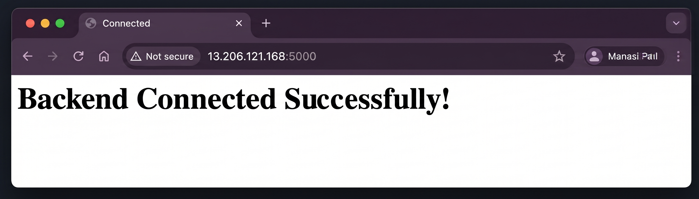
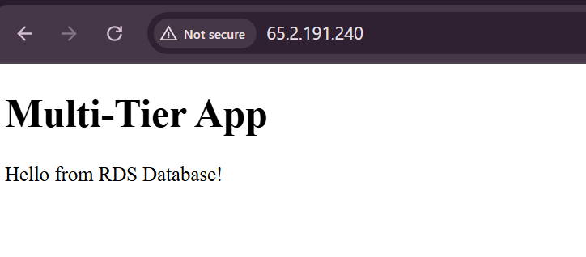

# 🌐 AWS Multi-Tier Web Application (EC2 + Flask + RDS)

##  Project Overview

This project demonstrates a complete multi-tier web application deployed on AWS. It includes a frontend hosted on EC2, a backend API built using Flask, and a MySQL database hosted on Amazon RDS.

The application fetches data from the database through the backend and displays it on the frontend, showcasing real-world cloud architecture.

---

##  Objectives

* Build a multi-tier architecture (Frontend → Backend → Database)
* Deploy application components on AWS
* Enable secure communication between layers
* Fetch and display real-time data from database

---

##  AWS Services Used

* Amazon EC2 (Frontend & Backend)
* Amazon RDS (MySQL)
* Security Groups (Access Control & Networking)

---

##  Architecture

### 🔹 Architecture Diagram (Simplified)

```
User (Browser)
   │
   ▼
Frontend EC2 (HTML + JavaScript)
   │
   ▼
Backend EC2 (Flask API)
   │
   ▼
RDS MySQL Database
```

---

###  Architecture Flow

User → Frontend → Backend API → RDS Database → Response → Frontend

---

##  Components

### 🔹 Frontend (EC2)

* Serves static HTML page
* Uses JavaScript `fetch()` to call backend API
* Displays data dynamically on browser

### 🔹 Backend (Flask API on EC2)

* Handles HTTP requests
* Connects to RDS database
* Fetches and returns data

### 🔹 RDS MySQL

* Stores application data
* Responds to backend queries

### 🔹 Security Groups

* Controls traffic between layers:

  * Frontend → Backend (Port 5000)
  * Backend → RDS (Port 3306)

---

##  Implementation Steps

### 🔹 RDS Setup

* Created MySQL database instance
* Database name: `appdb`
* Created table:

  ```
  message (id, text)
  ```
* Inserted data:

  ```
  Hello from RDS Database!
  ```

---

### 🔹 Backend Setup (Flask)

* Installed dependencies:

  * flask
  * flask-cors
  * mysql-connector-python
* Created API endpoint:

  ```
  GET /
  ```
* Connected Flask app to RDS database

---

### 🔹 Frontend Setup

* Hosted HTML page on EC2
* Used JavaScript `fetch()` to call backend
* Displayed response dynamically

---

### 🔹 Security Configuration

* Frontend EC2 → Port 80 open
* Backend EC2 → Port 5000 open
* RDS → Port 3306 allowed from backend only

---

##  Testing & Output

Application successfully tested:

✔ Frontend loads in browser
✔ Backend API responds correctly
✔ Data fetched from RDS
✔ End-to-end flow working

---

##  Screenshots

### 🔹 EC2 Instances


### 🔹 Backend Running



### 🔹 RDS Database


### 🔹 Final Output



---

## ⚠️ Challenges Faced

* CORS error while connecting frontend to backend
* Backend not reachable due to port restrictions
* SSH connection issues
* Database connection blocked due to security group

---

##  Solutions Implemented

* Enabled CORS using Flask-CORS
* Opened required ports in security groups
* Fixed SSH configuration
* Allowed backend EC2 access in RDS

---

##  Key Learnings

* Multi-tier architecture design
* AWS EC2 and RDS integration
* Security group configuration
* Backend API development
* Debugging real-world cloud issues

---

##  Future Improvements

* Add Application Load Balancer (ALB)
* Deploy backend using Gunicorn
* Add user input and database insert feature
* Containerize using Docker

---

##  Author

Mrunali Patil
